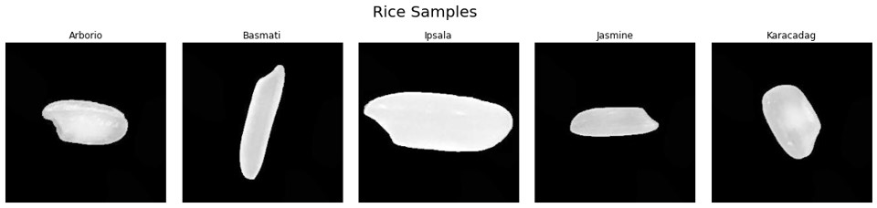
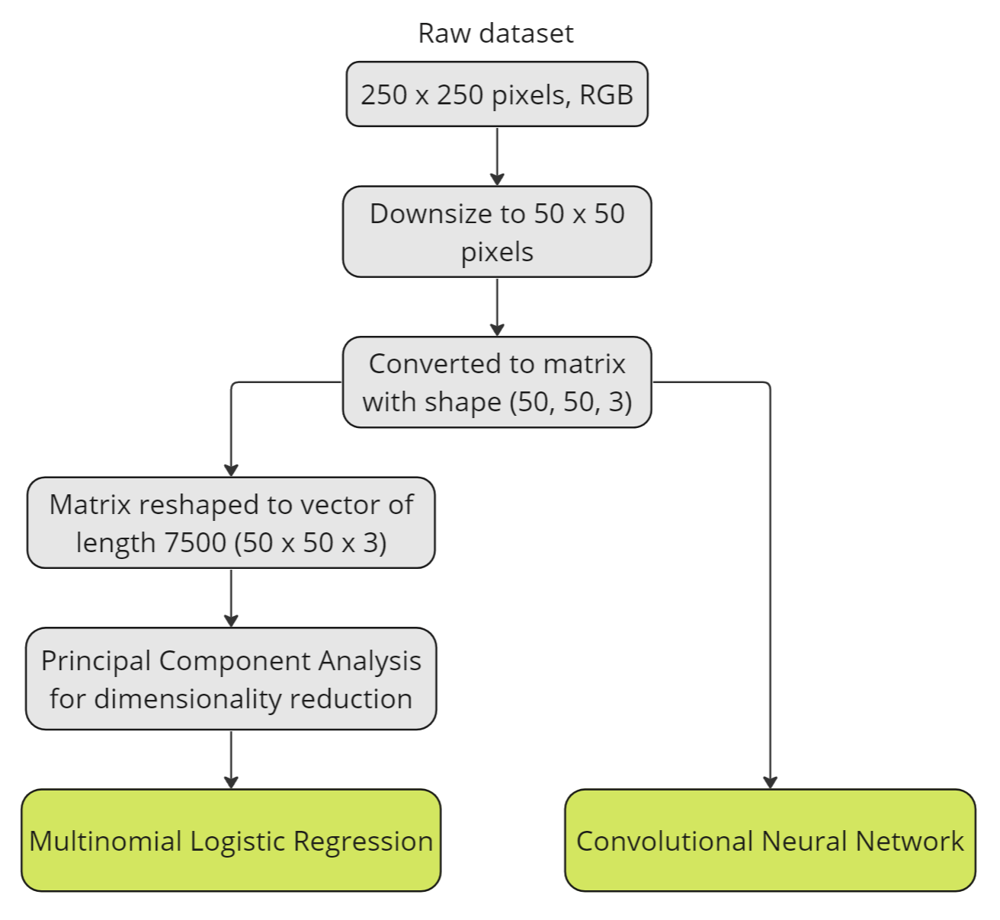
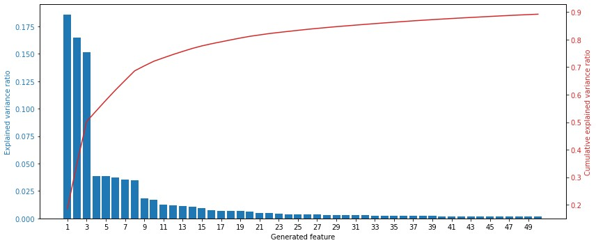
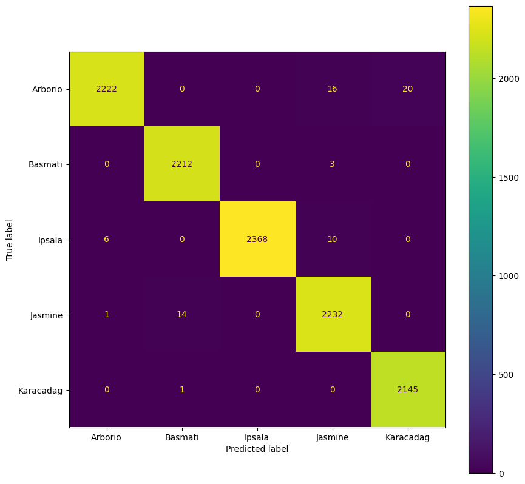

# Aalto-ML

Machine Learning project for Aalto University's CS-C3240 - Machine Learning D course. This report was adapted from the one submitted for the class.

# Introduction

Using the right grain of rice in your cooking is essential for
satisfactory results. For example, Arborio grains are used for dishes
such as risotto but they look highly similar to Ipsala and Karacadag
grains. However, if Arborio is not used, then factors such as cook time
and starchiness is affected, resulting in unsatisfactory food. Hence,
being able to pick the right grains of rice is an essential problem to
solve.

This machine learning project will focus on the classification of rice
grains using a dataset of five rice varieties: Arborio, Basmati, Ipsala,
Jasmine and Karacadag. The goal is to use **supervised learning** to
train a model that can, given an image of a grain of rice, predict as
accurately as possible which of the five varieties of rice it is.
Multinomial Logistic Regression and Convolutional Neural Networks (CNN)
will be used as the two machine learning models.

# Problem Formulation

The dataset was sourced from
[Kaggle](https://www.kaggle.com/datasets/muratkokludataset/rice-image-dataset)
[[3]](#3). **It should be noted that this machine learning problem is
similar to the ones that others have come up with using the same Kaggle
dataset. While other solutions immediately applied a machine learning
model on the raw dataset, our first strategy involves reducing the
number of features by downsizing the image then conducting principal
component analysis (PCA) for logistic regression, and our second
strategy was to experiment with different convolutional neural network
(CNN) architectures, which is distinct from what others have done on
[Kaggle](https://www.kaggle.com/datasets/muratkokludataset/rice-image-dataset).**

The original data set consists of 75,000 coloured images with 15,000
images of each rice variety. Each image contains a relatively centered
single rice grain on a black background and is 250x250 pixels. The data
type is categorical.

Initially, the total number of features per image is 62,500, which is
the number of pixels in a 250x250 pixel image. The data is pre-processed
to reduce the number of features. All images are labelled with their
rice variety according to their sub-folder name, which is either
\"Arborio\", \"Basmati\", \"Ipsala\", \"Jasmine\" or \"Karacadag\".

# Methods

## Pre-processing Data

All the images are downsized to 50x50 pixels to reduce the number of
pixels in each image from 62,500 to 2,500. This reduces the
computational resources required to run the machine learning models so
they will run faster on our personal computers. Then the images are
converted to a matrix with shape (50, 50, 3).

The next strategy used in the pre-processing stage is to use Principal
Component Analysis (PCA) to reduce the number of features for the
logistic regression model. The matrix is reshaped into a vector of
length 7500 for PCA. PCA was not done on the input to the CNN model
since the CNN model has dimensionality reduction built into the neural
network. This flowchart shows the steps used in pre-processing the
image data.

  

## Principal Component Analysis

PCA can be applied to the dataset to further reduce the number of
dimensions. Even after downsizing the image, there are still 2,500
pixels per image and 75,000 images in the data set, further reducing the
dimensions would be necessary to reduce the computational power required
to run the machine learning model.

PCA does not have a loss function associated with it. It transforms a
large set of variables into a smaller one that contains most of the
information of the larger set. This involves standardizing the range of
variables to the same scale so each one contributes equally to analysis.
Then, the covariance matrix is computed to determine if there is a
relationship between the variables in the input data. After that, the
principal components of the data are determined, which are new variables
that linear combinations of the initial variables and are
uncorrelated. [[2]](#2)

The explained variance ratio and cumulative explained variance ratio was
plotted against 50 generated features, as seen in this figure. 

  

50 features were kept for the machine learning models since the expected variance ratio past 50 features would have been very low and negligible.

The code used to conduct the PCA was referenced from assignment 2 of the CS-C3240 Machine Learning course.

## Feature Selection

The features output from the PCA will be used as inputs to train the
Multinomial Logistic Regression model. The input used for the
Convolutional Neural Network are the images represented by the 3D matrix
consisting of 50x50 pixels and 3 RGB channels per pixel. CNNs are
designed to take in matrix-like data, which allows them to analyze the
spatial properties of an image, hence the features for the CNN is
50x50x3 for each image. During training, filters automatically learn to
detect features like edges, textures, patterns, and object parts.

## Model Validation

For both machine learning models used, the data set is split into the
training, validation and testing data set in a 70/15/15 ratio. This is
achieved by splitting the data twice, with the first splitting the
dataset randomly into a 70/30 split, then the 30% of the dataset will be
randomly split in half again, thus forming a 70/15/15 split. The
training set will have 52,500 images, the validation set will have
11,250 and the test set will also have 11,250 images. More data was
allocated for training than for testing and validation. The specific
ratio was chosen based on common data partitioning practices.

## Convolutional Neural Network

The first model chosen is a Convolutional Neural Network (CNN). CNNs
have advantages in processing images due to their ability to take into
account spatial information by analyzing groups of pixels at a time
instead of individual pixels. CNNs achieve this 'group analysis' with
the use of matrices instead of flattening data into vectors before being
used as input to the CNN. Instead of tackling hyperparameters, the
approach taken was to experiment with CNN architectures instead.The
various architectures were a mix of common architectures like LeNet-5
and VGG as well as a mix of Conv2D, MaxPooling, Flatten, and Dense
layers, and was inspired by an article on building CNN architectures
[[6]](#6).

The loss function chosen for the CNN is the sparse categorical
cross-entropy loss function. The sparse categorical cross-entropy
function was chosen due to its suitability for multi-class outputs or in
other words, it fits the 5 possible rice grain type labels
[[4]](#4)[[5]](#5).

The CNN models were implemented using TensorFlow's sequential model. The
models did not use the padding hyperparameter as the images are well
centered, with no useful information around the edges and corners. If
padding were to be used for the CNN, its performance could possibly be
lower.

## Multinomial Logistic Regression

Multinomial logistic regression can be used for multi-class
classification tasks. It is an extension of binary logistic regression
used for two-class classification problems. This model is chosen as it
is simple and we wanted to compare the results of its classification to
a more complicated model like CNN.

The loss function used for training the model is the logistic loss. This
loss function is chosen because it is used by sklearn in its multinomial
logistic regression model. It is also a the loss function typically used
in logistic regression models. For model validation, the average 0/1
loss is used as it allowed for the use of the `accuracy_score` metric
from `sklearn`.

The model is implemented using the `sklearn` library's
`LogisticRegression` model, with 'saga' as the solver as this solver is
faster for larger data sets. The default L2 regularization was used to
prevent over-fitting and improve the generalization in the machine
learning model. This method adds the squares of the coefficients to the
loss function which results in a model with small, non-zero
coefficients [[1]](#1).

The effect of the inverse of regularization strength, C on the training
and validation accuracy was observed. It was seen that across the
different values of C, the values of training and validation accuracy do
not vary significantly. 

  

Thus, the default value of C = 1.0 is used. This could be because the dataset containing 75000 images is not prone to overfitting, and because the
size of the dataset is large.

# Results

The errors in the training, validation, and test set can be calculated
in the form of the accuracy score, which measures the ratio of correct
predictions over the total number of instances evaluated. This table shows the accuracy of the various CNN architectures when tested using the test dataset.

  | **model**   |  **accuracy** (%) |                   architecture                  |
  | ----------- | ----------------- | ------------------------------------------------|
  |   cnn0      |     98.52         |    conv2d, maxpooling, flatten, dense, dense    |
  |   cnn1      |    99.43          |                    LeNet-5                      |
  |   cnn2      |     99.59         |  3\*(conv2d, maxpooling), flatten, dense, dense |
  |   cnn3      |     99.52         |                     VGG-like                    |

For the logistic regression model, the training accuracy score is 94.6%
and the testing accuracy score is 94.0%. The the model was trained again
with the training and validation sets, and tested on the test set, which
as explained in section [3.4], consisted of 15% of the original data set
that was not used for either training or validation. The test accuracy
is 95.2% and results in the confusion matrix found in below.

On the other hand, the CNN models tested also performed extremely well,
with training accuracy scores being above 96%, and producing a top
accuracy of 99.59% with the 'cnn2' architecture on the test dataset. The
results can be observed in the confusion matrix below. 

| Confusion Matrix (Logistic Regression) | Confusion Matrix (CNN) |
| -------------------------------------- | ---------------------- |
|    |   |

# Conclusion

## Discussion of results

For the logistic regression model, the training and validation accuracy
scores do not differ much from each other, which suggests that the model
is trained well. There is unlikely to be a problem of overfitting of the
training dataset. However, from the confusion matrix for Logistic Regression, it is clear that the
model has a slight tendency to predict the jasmine and basmati rice
grains wrongly. There were 246 instances where jasmine was wrongly
predicted to be basmati, while there were 129 instances where basmati
was wrongly predicted to be jasmine. From visual inspection, the two
rice grains are relatively similar to begin with, reducing
dimensionality using PCA might have reduced the differences between the
two rice grains such that the accuracy of classification is reduced.
Perhaps retaining more features from PCA would improve the performance
of the model.

For the CNN models, the training and validation accuracy scores can be
observed in the accuracy vs epoch plots found in appendix C. There are
slight differences amongst the various CNN architectures, with some
validation accuracy scores following the training accuracy scores very
closely while the relationship between training and validation accuracy
fluctuates more in other architectures. This shows that while the CNN
models may have great accuracy scores, they may be overfit on training
data, and their hyperparameters could likely be better tuned.

## Comparing the two models

The performance of the CNN model outperforms that of the Logistic
Regression model. There are several reasons for this. First, CNN is able
to take advantage of the spatial features in the image, which can
account for relationships between pixels and the high level features
that emerge. On the other hand, logistic regression is not able to take
spatial relationships into account and instead treats each pixel
independently. Additionally, CNN is able to learn features like
patterns, edges and even more complex features in the process of
training the model. However, logistic regression relies on manually
engineered features which in this case, are the outputs of the PCA.
Hence, based on the accuracy scores of both models, the CNN model, in
particular with the 'cnn2' architecture, is chosen to solve the ML
problem of rice classification.

## Future work

While the accuracy of both models is high, both being above 90%, it is
likely that both models will not be able to perform well in a real world
situation due to the lack of diversity in the dataset. The dataset only
included well-centered rice grains with white backgrounds which is an
unlikely situation in the real world. To improve the practicality of the
models, the use of more data, especially with more background types or
different positions of the rice grain within the frame, the introduction
of noise, as well as the inclusion of foreign objects in the frame via
the collection of more data or the use of synthetic data techniques
would likely enable robust model performance in the real world.

# References
<a id="1">[1]</a> Saturn Cloud. Regularized logistic regression in python: A guide,   2023. https://saturncloud.io/blog/regularized-logistic-regression-in-python-a-comprehensive-guide/#:~:text=L2%20regularization%20adds%20the%20square,the%20generalization%20of%20the%20model [Accessed:
10-10-23].

<a id="2">[2]</a> Zakaria Jaadi. A step-by-step explanation of principal component analysis (pca), 2023. https://builtin.com/data-science/step-step-explanation-principal-component-analysis [Accessed: 21-09-23].

<a id="3">[3]</a> Murat Koklu. Rice image dataset, 2022. https://www.kaggle.com/datasets/muratkokludataset/rice-image-dataset [Accessed: 21-09-23].

<a id="4">[4]</a> Ajitesh Kumar. Keras – categorical cross entropy loss function, 2020. https://vitalflux.com/keras-categorical-cross-entropy-loss-function/ [Accessed: 22-09-23].

<a id="5">[5] </a>Felipe A. Moreno. Sparse categorical cross-entropy vs categorical cross-entropy, 2021. https://towardsdatascience.com/a-guide-to-an-efficient-way-to-build-neural-network-architectures-part-ii-hyper-//fmorenovr.medium.com/sparse-categorical-cross-entropy-vs-categorical-cross-entropy-ea01d0392d28
[Accessed: 10-10-23].

<a id="6">[6]</a> Shashank Ramesh. A guide to an efficient way to build neural network
architectures- part ii: Hyper-parameter selection and tuning for convolutional neural
networks using hyperas on fashion-mnist, 2018. https://towardsdatascience.com/a-guide-to-an-efficient-way-to-build-neural-network-architectures-part-ii-hyper-parameter-42efca01e5d7
[Accessed: 09-10-23].